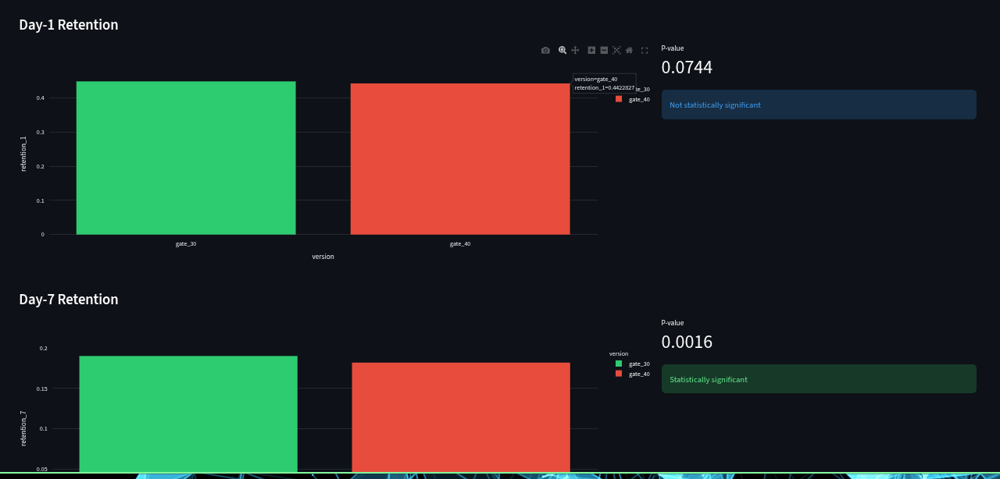

# Cookie Cats A/B testing

Using "Cookie Cats" dataset to A/B test. It examines what happens when player installs game and randomly assigned to gate_30 and gate_40. 
The data we have is from 90,189 players that installed the game while the AB-test was running. The variables are:

**userid**: A unique number that identifies each player.
**version**: Whether the player was put in the control group (gate_30 - a gate at level 30) or the group with the moved gate (gate_40 - a gate at level 40).
**sum_gamerounds**: the number of game rounds played by the player during the first 14 days after install.
**retention_1**: Did the player come back and play 1 day after installing?
**retention_7**: Did the player come back and play 7 days after installing?

When a player installed the game, he or she was randomly assigned to either.

## Project Goal

The goal of this project is to see which version is more likely to make player come back and play ( higher retention rate ). So stakeholder or devs would have data based information. 

## Architecture
Kaggle CSVs (1 file1)
│
▼
Python / pandas (dashboard/app.py, notebooks/explore.py)


## Tech Stack

- **Python** (pandas, streamlit, plotly.express) — extraction, visualization and transformation
- **Git** — version-controlled


## Interactive Dashboard

Built with Streamlit + Plotly to make the statisical comparison explorable.




Run it locally with:
```bash
streamlit run dashboard/app.py
```

